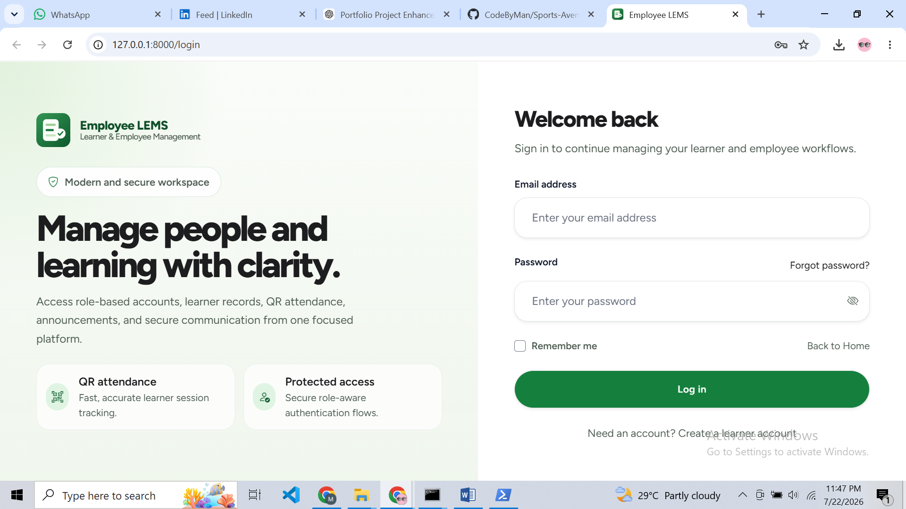
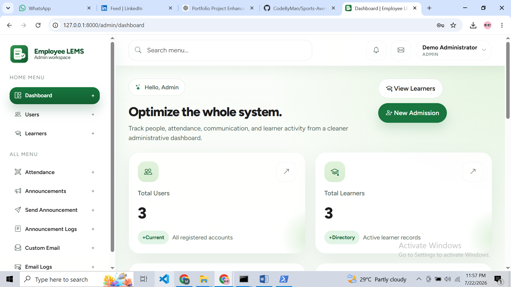
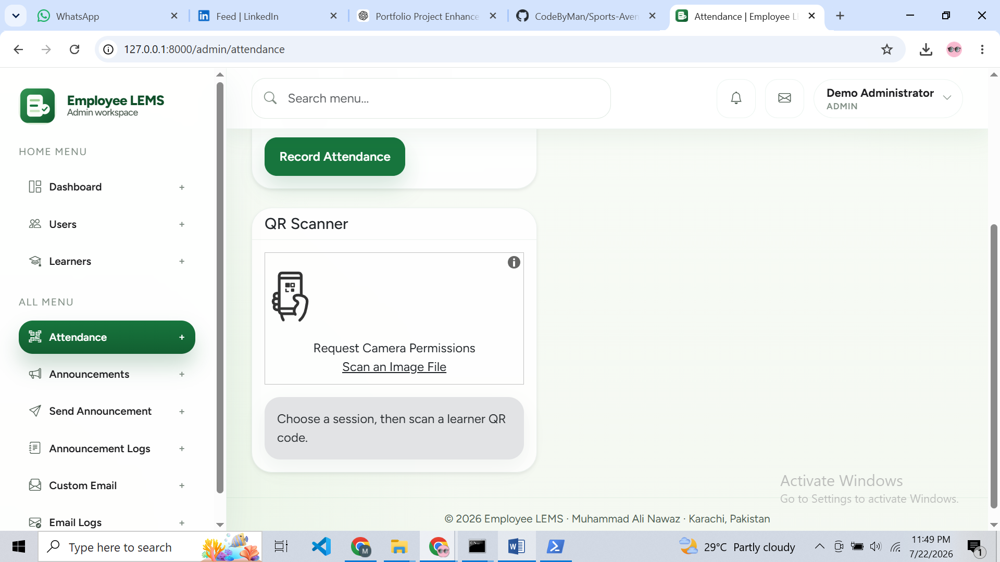

<p align="center">
  
</p>

<h1 align="center">🎓 Employee LEMS</h1>

<p align="center">
  <b>A secure Laravel learner and employee management system with role-based dashboards, QR attendance, managed registration, announcements, email communication, and administrative audit logs.</b>
</p>

<p align="center">
  
  
  
  
  
  
</p>

<p align="center">
  
  
  
  
</p>

---

## 📸 Project Screenshots


| Landing Page | Login Page |
|---|---|
|  |  |

| Administration Dashboard | QR Attendance |
|---|---|
|  |  |

---

## 🚀 Project Overview

**Employee LEMS** is a full-stack Laravel web application built for schools, academies, coaching centres, training institutes, and corporate learning environments that need a structured way to manage learners, employees, attendance, announcements, and account communication.

The application provides separate **administrator**, **employee**, and **learner** experiences. Administrators can manage users and learner records, generate learner QR identifiers, record AM/PM attendance, send announcements, send custom or welcome emails, and review communication logs.

---

## 🎯 Project Purpose

Training organisations need more than basic login and registration. They need protected user roles, learner records, attendance tracking, communication tools, and reliable administrative safeguards.

**Employee LEMS** brings these workflows into one modern and secure platform:

- Register and manage application users
- Maintain learner profiles
- Generate QR attendance identifiers
- Record daily AM and PM sessions
- Publish and send announcements
- Send welcome and custom emails
- Review email and announcement audit logs
- Protect administrator-only actions through roles and policies

The project is designed as a portfolio-ready Laravel application demonstrating both polished frontend implementation and secure backend workflow design.

---

## 🎯 Key Highlights

- 🎓 Learner and employee management platform
- 👑 Administrator, employee, and learner roles
- 🔐 Laravel Breeze authentication
- ✉️ Email verification and password reset
- 🔢 OTP-protected administrator registration flow
- 👥 Administrator user management
- 🧑‍🎓 Learner profile management
- 🆔 Automatic unique learner QR identifiers
- 📷 Browser-based QR attendance scanner
- 🕘 AM check-in, AM check-out, PM check-in, and PM check-out
- 🚫 Duplicate daily attendance-session prevention
- 📢 Announcement creation and audience targeting
- 📨 Announcement delivery and resend workflow
- 📬 Welcome and custom email functionality
- 🧾 Email and announcement audit logs
- 🛡️ Final-administrator deletion and demotion protection
- 🔒 Policy, middleware, validation, and CSRF protection
- 🌱 Guarded local demo seeding
- 📱 Responsive portfolio-grade frontend
- 🧪 57 passing automated tests with 200 assertions
- 🎨 Laravel Pint code-style verification
- 📦 Vite production asset compilation

---

## ✨ Features

### 🔐 Authentication & Account Features

| Feature | Description |
|---|---|
| Login and Logout | Secure session-based authentication through Laravel Breeze |
| Learner Registration | Public registration creates a learner-role account |
| Email Verification | Protected dashboard access requires verified email addresses |
| Password Reset | Forgot-password and token-based password reset flow |
| Password Confirmation | Sensitive actions require password confirmation where appropriate |
| Password Visibility | Login and registration forms include show/hide password controls |
| Profile Management | Users can update their name, email address, and password |
| Account Deletion | Authenticated users can delete their own profile with password confirmation |
| Strong Password Rules | Registration and managed-user creation enforce secure password validation |

---

### 👑 Administration Features

| Feature | Description |
|---|---|
| Admin Dashboard | Displays counts for users, learners, employees, email logs, announcements, and attendance records |
| User Directory | View paginated user accounts and assigned roles |
| Managed Registration | Administrators can start an OTP-protected user registration flow |
| User Editing | Update another user's name, email address, and allowed role |
| Welcome Emails | Select users and send welcome emails |
| User Deletion | Delete managed accounts while preserving final-administrator safety |
| Profile Management | Administrators can update their profile and password |
| Role Protection | Employees and learners cannot access administrator routes |

---

### 🧑‍🎓 Learner Management Features

| Feature | Description |
|---|---|
| Learner Directory | View learner records through a responsive paginated table |
| Add Learner | Create a learner profile with validated personal and academic details |
| Edit Learner | Update learner information through protected administrator actions |
| Delete Learner | Remove a learner and related attendance history |
| Duplicate Email Protection | Prevent duplicate learner email records |
| Grade and Section | Store learner grade level and section data |
| Automatic QR Code | Generate a unique QR attendance identifier on the server |
| Authorization Policies | Prevent non-administrators from modifying learner records |

---

### 📷 QR Attendance Features

| Feature | Description |
|---|---|
| Manual Attendance | Select a learner and record an attendance session manually |
| Browser QR Scanner | Scan learner QR codes through a compatible browser camera |
| QR Lookup | Resolve scanned QR identifiers to learner records |
| AM Check-In | Record morning arrival time |
| AM Check-Out | Record morning departure time |
| PM Check-In | Record afternoon arrival time |
| PM Check-Out | Record afternoon departure time |
| Daily Record | Maintain one attendance record per learner per date |
| Duplicate Prevention | Reject repeated entries for an already-recorded daily session |
| Invalid QR Protection | Reject unknown or malformed learner QR values |
| Today's Records | Display the current day's learner attendance entries |

---

### 📢 Announcement Features

| Feature | Description |
|---|---|
| Create Announcement | Save announcement title and message content |
| Audience Selection | Target all learners or filter by grade level and section |
| Send Announcement | Deliver announcement emails to the selected learner audience |
| Recipient Limit | Synchronous delivery is limited to a safe recipient batch size |
| Resend Announcement | Resend an existing announcement through a protected workflow |
| Announcement Logs | Review success and failure records for deliveries |
| Safe Author Attribution | The authenticated administrator is recorded as the author |
| Header Injection Protection | Announcement titles reject newline-based header injection |

---

### 📨 Email & Audit Features

| Feature | Description |
|---|---|
| Welcome Email | Send onboarding messages to selected registered users |
| Custom Email | Send administrator-authored plain-text email content |
| Email Audit Log | Review recipient, subject, status, and send time |
| Delivery Status | Distinguish successful and failed message attempts |
| Safe Error Metadata | Store safe failure information without exposing sensitive exception content |
| Escaped Email Content | Render custom messages as escaped plain text |
| Local Log Mailer | Test email workflows locally without external SMTP credentials |
| SMTP Ready | Configure a production mail provider through environment variables |

---

## 🧑‍💼 User Roles

| Role | Access Level |
|---|---|
| 👑 Administrator | Full access to dashboard metrics, users, learners, attendance, announcements, custom email, logs, and administrator profile settings |
| 🧑‍💼 Employee | Protected employee dashboard and personal profile management; no administrator access |
| 🎓 Learner | Learner dashboard, authentication, email verification, and personal profile management; no administrator access |

---

## 🛠 Tech Stack

| Layer | Technologies |
|---|---|
| Backend | Laravel 12, PHP 8.2+ |
| Database | MySQL / MariaDB |
| Authentication | Laravel Breeze |
| Roles & Permissions | Spatie Laravel Permission 6 |
| Frontend Templates | Blade |
| UI & Styling | Bootstrap 5.3, Tailwind CSS 3 |
| Frontend Behaviour | Alpine.js, JavaScript |
| Dashboard Charts | Chart.js |
| QR Scanner | html5-qrcode |
| Alerts | SweetAlert2 |
| HTTP Client | Axios |
| Asset Build | Vite 6 |
| Testing | PHPUnit 11, Laravel Feature Tests |
| Code Style | Laravel Pint |
| Package Management | Composer, NPM |
| Mail | Laravel Mail; log mailer locally and SMTP-ready configuration |

---

## 🏗 Architecture Overview

The project follows Laravel MVC conventions with dedicated controllers, Eloquent models, policies, service classes, Blade views, middleware, migrations, and automated tests.

```text
Employee-LEMS-Laravel/
├── app/
│   ├── Http/
│   │   ├── Controllers/
│   │   │   ├── Admin/
│   │   │   │   └── LearnerAttendanceController.php
│   │   │   ├── Auth/
│   │   │   ├── AdminController.php
│   │   │   ├── AnnouncementController.php
│   │   │   ├── EmailLogController.php
│   │   │   ├── EmployeeController.php
│   │   │   ├── LearnerController.php
│   │   │   ├── ProfileController.php
│   │   │   ├── RegisterController.php
│   │   │   └── UserController.php
│   │   └── Requests/
│   ├── Mail/
│   ├── Models/
│   ├── Policies/
│   ├── Providers/
│   └── Services/
├── config/
├── database/
│   ├── factories/
│   ├── migrations/
│   └── seeders/
├── docs/
│   ├── screenshots/
│   ├── FILE_INSPECTION_MANIFEST.md
│   ├── PORTFOLIO_REVIEW.md
│   └── VERIFICATION_COMMANDS.md
├── public/
│   ├── images/
│   │   └── logo.svg
│   └── favicon.svg
├── resources/
│   ├── css/
│   ├── js/
│   └── views/
├── routes/
│   ├── auth.php
│   └── web.php
├── tests/
│   ├── Feature/
│   └── Unit/
├── .env.example
├── artisan
├── composer.json
├── package.json
└── README.md
```

---

## 🔄 Application Flow

### Learner Registration Flow

```text
Open Registration Page
        ↓
Submit Name, Email, and Password
        ↓
Learner Role Is Assigned
        ↓
Verification Email Is Generated
        ↓
Verify Email Address
        ↓
Open Learner Dashboard
```

### Administrator Managed-User Flow

```text
Administrator Login
        ↓
Open User Management
        ↓
Enter User Details and Role
        ↓
Registration OTP Is Sent
        ↓
Administrator Enters Valid OTP
        ↓
User Account Is Created
```

### QR Attendance Flow

```text
Administrator Opens Attendance
        ↓
Choose AM or PM Session
        ↓
Scan Learner QR Code
        ↓
Validate QR Identifier
        ↓
Find Learner Record
        ↓
Create or Update Today's Attendance
        ↓
Reject Duplicate Session Entry
```

### Announcement Flow

```text
Administrator Creates Announcement
        ↓
Select Announcement
        ↓
Choose Grade and Section Audience
        ↓
Resolve Matching Learners
        ↓
Send Announcement Emails
        ↓
Store Delivery Logs
```

---

## 🗄 Database Overview

The application uses MySQL or MariaDB with Laravel migrations.

### Main Data Areas

| Data Area | Purpose |
|---|---|
| Users | Stores administrator, employee, and learner authentication accounts |
| Roles and Permissions | Stores Spatie role and permission relationships |
| Learners | Stores learner identity, grade, section, email, and QR identifier |
| Learner Attendance | Stores daily AM and PM attendance-session timestamps |
| Announcements | Stores announcement content and authenticated author data |
| Announcement Targets | Stores selected grade and section targeting information |
| Announcement Logs | Stores delivery status for announcement recipients |
| Email Logs | Stores custom and welcome email audit information |
| Cache | Supports Laravel database cache configuration |
| Jobs | Supports Laravel queue infrastructure |
| Sessions | Stores database-backed authenticated sessions |
| Password Reset Tokens | Supports password-reset workflows |

---

## 🔐 Security Implementations

| Security Area | Implementation |
|---|---|
| Authentication | Laravel Breeze session authentication |
| Email Verification | Dashboard routes require verified email addresses |
| Password Security | Laravel hashing and validated password rules |
| Role-Based Access | Spatie role middleware for administrator, employee, and learner routes |
| Authorization Policies | Policies protect users, learners, and announcements |
| Protected Admin Routes | All administrator workflows require authenticated, verified admin role |
| CSRF Protection | Laravel CSRF middleware protects state-changing forms |
| Mass Assignment | Eloquent fillable/guarded configuration protects model assignment |
| Final Administrator | Transactional safeguards prevent deletion or demotion of the final administrator |
| OTP Rate Limiting | Administrator registration and OTP verification are throttled |
| OTP Expiration | Registration codes expire and invalid attempts are limited |
| QR Validation | Unknown learner QR identifiers are rejected |
| Duplicate Attendance | Database and application logic prevent duplicate learner/date sessions |
| Email Header Safety | Subjects reject newline-based email-header injection |
| Safe Email Rendering | Custom email content is escaped as plain text |
| Safe Error Logging | Mail failures log safe metadata rather than sensitive exception details |
| Environment Security | Credentials remain in `.env`, which is excluded from Git |
| Guarded Demo Seeder | Demo data requires local environment, explicit flag, and strong password |
| Encrypted Sessions | Environment example enables database sessions and session encryption |

---

## ⚡ Performance & Code Quality

- Uses Laravel MVC structure and Eloquent relationships
- Uses dedicated policies for authorization decisions
- Uses a service class for administrator-account invariants
- Uses Form Request validation for profile updates
- Uses database indexes and unique constraints for critical records
- Uses pagination for user, learner, attendance, and log tables
- Uses eager loading where related records are displayed
- Uses server-controlled QR generation
- Uses Vite for optimized production assets
- Uses responsive Blade layouts and reusable components
- Uses environment-controlled mail and database configuration
- Includes automated authentication, authorization, security, and workflow tests
- Includes Laravel Pint formatting validation
- Includes npm dependency-audit verification
- Includes portfolio review and verification documentation

---

## 📡 Routes / System Areas

| Area | Purpose |
|---|---|
| `/` | Public landing page |
| `/login` | User login |
| `/register` | Public learner registration |
| `/forgot-password` | Password-reset request |
| `/dashboard` | Role-aware dashboard redirect |
| `/profile` | Employee and learner profile management |
| `/admin/dashboard` | Administrator dashboard |
| `/admin/profile` | Administrator profile management |
| `/admin/register-user` | Begin managed-user registration |
| `/admin/verify-otp` | Verify administrator registration OTP |
| `/admin/users` | User management |
| `/admin/learners` | Learner directory and CRUD workflows |
| `/admin/attendance` | Manual and QR attendance |
| `/admin/announcements` | Create and manage announcements |
| `/admin/announcements/send` | Select audience and send announcement |
| `/admin/announcement-logs` | Announcement delivery logs |
| `/admin/custom-email` | Send custom email |
| `/admin/email-logs` | Email audit logs |
| `/employee/dashboard` | Employee dashboard |
| `/learner/dashboard` | Learner dashboard |

---

## ⚙️ Installation Guide

### Requirements

- PHP 8.2 or higher
- Composer 2
- Node.js 20+ and NPM
- MySQL or MariaDB
- XAMPP, WAMP, Laragon, or a comparable local environment
- Git

---

### 1️⃣ Clone the Repository

```bash
git clone https://github.com/CodeByMan/Employee-LEMS-Laravel.git
cd Employee-LEMS-Laravel
```

---

### 2️⃣ Install PHP Dependencies

```bash
composer install
```

---

### 3️⃣ Install Frontend Dependencies

```bash
npm ci
```

Use `npm install` only when intentionally updating dependency versions.

---

### 4️⃣ Create the Environment File

Windows PowerShell:

```powershell
Copy-Item .env.example .env
```

Windows Command Prompt:

```bat
copy .env.example .env
```

macOS/Linux:

```bash
cp .env.example .env
```

---

### 5️⃣ Generate the Application Key

```bash
php artisan key:generate
```

---

### 6️⃣ Create the Database

Example MySQL/MariaDB setup using a dedicated local account:

```sql
CREATE DATABASE employee_lems
    CHARACTER SET utf8mb4
    COLLATE utf8mb4_unicode_ci;

CREATE USER 'employee_lems'@'127.0.0.1'
    IDENTIFIED BY 'replace-with-a-strong-local-password';

GRANT ALL PRIVILEGES ON employee_lems.*
    TO 'employee_lems'@'127.0.0.1';

FLUSH PRIVILEGES;
```

Update `.env`:

```env
APP_NAME="Employee LEMS"
APP_ENV=local
APP_DEBUG=true
APP_URL=http://127.0.0.1:8000
APP_TIMEZONE=Asia/Karachi

DB_CONNECTION=mysql
DB_HOST=127.0.0.1
DB_PORT=3306
DB_DATABASE=employee_lems
DB_USERNAME=employee_lems
DB_PASSWORD=replace-with-a-strong-local-password

MAIL_MAILER=log
ALLOW_DEMO_SEEDING=false
DEMO_PASSWORD=
```

Never commit the real `.env` file.

---

### 7️⃣ Run Database Migrations

```bash
php artisan migrate
```

---

### 8️⃣ Link Public Storage

```bash
php artisan storage:link
```

---

### 9️⃣ Build Frontend Assets

Production build:

```bash
npm run build
```

Development mode with automatic frontend refresh:

```bash
npm run dev
```

---

### 🔟 Start the Application

```bash
php artisan serve --host=127.0.0.1 --port=8000
```

Open:

```text
http://127.0.0.1:8000
```

---

## 🌱 Optional Local Demo Data

Demo seeding is intentionally guarded. It only runs when:

- The application environment is `local`
- `ALLOW_DEMO_SEEDING=true`
- `DEMO_PASSWORD` contains a strong password

> Warning: `migrate:fresh` deletes all existing tables and data. Use it only for a disposable local database.

Windows PowerShell:

```powershell
$env:ALLOW_DEMO_SEEDING = "true"
$env:DEMO_PASSWORD = "Local-Demo-Password-123"

php artisan migrate:fresh --seed

Remove-Item Env:ALLOW_DEMO_SEEDING
Remove-Item Env:DEMO_PASSWORD
```

macOS/Linux:

```bash
ALLOW_DEMO_SEEDING=true \
DEMO_PASSWORD='Local-Demo-Password-123' \
php artisan migrate:fresh --seed
```

---

## 🔑 Demo Login Credentials

After guarded demo seeding, use these accounts for local testing:

| Role | Email | Password | Access |
|---|---|---|---|
| 👑 Administrator | `admin@employee-lems.test` | `Local-Demo-Password-123` | Full administrator workspace |
| 🧑‍💼 Employee | `employee@employee-lems.test` | `Local-Demo-Password-123` | Employee dashboard and profile |
| 🎓 Learner | `learner@employee-lems.test` | `Local-Demo-Password-123` | Learner dashboard and profile |

---

## 📨 Mail Configuration

The default local configuration uses Laravel's log mailer:

```env
MAIL_MAILER=log
```

Messages are written to:

```text
storage/logs/laravel.log
```

For SMTP delivery, configure a real provider:

```env
MAIL_MAILER=smtp
MAIL_HOST=smtp.example.com
MAIL_PORT=587
MAIL_USERNAME=your-username
MAIL_PASSWORD=your-password
MAIL_ENCRYPTION=tls
MAIL_FROM_ADDRESS="noreply@example.com"
MAIL_FROM_NAME="${APP_NAME}"
```

Keep all production mail credentials in `.env` or a secure secrets manager.

---

## 🏗 Build for Production

Compile optimized frontend assets:

```bash
npm ci
npm run build
```

Recommended production environment settings:

```env
APP_ENV=production
APP_DEBUG=false
APP_URL=https://your-domain.example
SESSION_SECURE_COOKIE=true
MAIL_MAILER=smtp
ALLOW_DEMO_SEEDING=false
DEMO_PASSWORD=
```

Then run:

```bash
php artisan optimize
```

Never run the demo seeder against a production database.

---

## 🧪 Testing & Verification

Run the Laravel test suite:

```bash
php artisan test
```

Run the complete Composer test script:

```bash
composer test
```

Check code formatting:

```bash
./vendor/bin/pint --test
```

Windows PowerShell:

```powershell
.\vendor\bin\pint.bat --test
```

Audit frontend packages:

```bash
npm audit --audit-level=moderate
```

Build production assets:

```bash
npm run build
```

### Last Verified Results

| Verification | Result |
|---|---|
| Laravel Tests | ✅ 57 passed |
| Assertions | ✅ 200 assertions |
| Laravel Pint | ✅ 98 files passed |
| npm Audit | ✅ 0 vulnerabilities |
| Vite Build | ✅ Production build completed |
| MySQL/MariaDB Migrations | ✅ Completed successfully |
| Guarded Demo Seeder | ✅ Completed successfully |

---

## 📁 Important Folder Structure

```text
app/Http/Controllers/
├── Admin/
│   └── LearnerAttendanceController.php
├── Auth/
├── AdminController.php
├── AnnouncementController.php
├── EmailLogController.php
├── EmployeeController.php
├── LearnerController.php
├── ProfileController.php
├── RegisterController.php
└── UserController.php

app/Models/
├── Announcement.php
├── AnnouncementLog.php
├── AnnouncementTarget.php
├── EmailLog.php
├── Learner.php
├── LearnerAttendance.php
└── User.php

app/Policies/
├── AnnouncementPolicy.php
├── LearnerPolicy.php
└── UserPolicy.php

app/Services/
└── AdministratorAccountService.php

resources/views/
├── admin/
├── auth/
├── components/
├── employee/
├── learner/
├── layouts/
├── profile/
├── register.blade.php
└── welcome.blade.php

tests/Feature/
├── Auth/
├── AdminAuthorizationTest.php
├── AdminRegistrationTest.php
├── AnnouncementTest.php
├── AttendanceTest.php
├── CustomEmailSecurityTest.php
├── DemoSeederGuardTest.php
├── LearnerManagementTest.php
├── ProfileTest.php
└── UserManagementTest.php
```

---

## ✅ Testing Checklist

- [x] Install Composer dependencies
- [x] Install NPM dependencies
- [x] Configure `.env`
- [x] Generate application key
- [x] Connect MySQL/MariaDB
- [x] Run all migrations
- [x] Run guarded demo seeding
- [x] Create the public storage link
- [x] Build Vite production assets
- [x] Open the landing page
- [x] Test login and logout
- [x] Test learner registration
- [x] Test email verification workflow
- [x] Test role-based dashboard access
- [x] Test user management authorization
- [x] Test learner CRUD authorization
- [x] Test learner QR generation
- [x] Test manual attendance
- [x] Test QR attendance lookup
- [x] Test duplicate-session prevention
- [x] Test invalid QR rejection
- [x] Test announcement creation and delivery logging
- [x] Test custom email security
- [x] Test final-administrator safeguards
- [x] Run 57 automated tests
- [x] Verify 200 assertions
- [x] Run Laravel Pint
- [x] Run npm security audit

---

## 👨‍💻 Author

**Muhammad Ali Nawaz**  
PHP / Laravel Developer

---

## 📄 License

This project is open-source software licensed under the [MIT License](LICENSE).

---

<p align="center">
  <b>⭐ If you find this project useful, consider starring the repository!</b>
</p>
